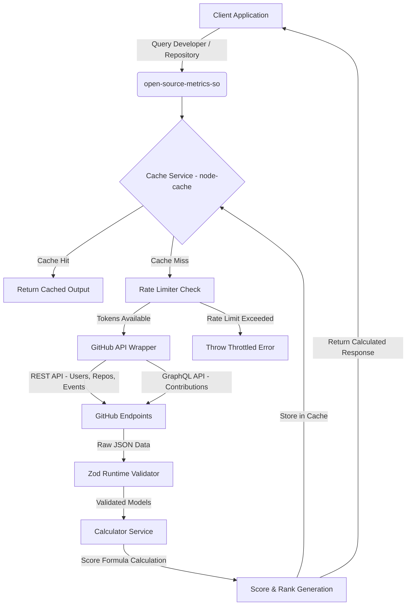

# open-source-metrics-so

[](https://www.npmjs.com/)
[](https://www.typescriptlang.org/)
[](LICENSE)
[](https://jestjs.io/)

A high-performance Node.js/TypeScript analytics library designed to track developer ecosystem trends, contribution velocity, code frequency, and issue resolution metrics across emerging communities utilizing the GitHub GraphQL and REST APIs.

---

## 📐 Architecture Diagram



---

## ⚡ Features

- **TypeScript 5.0+ strict mode ready** with fully compiled ESM/CJS compatibility and automatic declaration generation.
- **Robust LRU/TTL caching** via `node-cache` to mitigate API limit penalties and fast-track consecutive queries.
- **Token Bucket Rate Limiting** preventing unexpected API depletion and handling traffic bursts gracefully.
- **Strict Runtime Validation** with Zod schemas verifying every API response structure before performing calculations.
- **Dynamic Scoring Models** using precise algorithmic formulas to evaluate developers and repositories.

---

## 🛠️ Installation

Install using `npm` or `yarn`:

```bash
npm install open-source-metrics-so
# OR
yarn add open-source-metrics-so
```

---

## ⚙️ Configuration & Environment Variables

Initialize your GitHub authentication by setting the following environment variable in your `.env` file:

```env
GITHUB_TOKEN=your_personal_access_token_here
```

---

## 🚀 Detailed Code Examples

### 1. Fetching Developer Metrics (REST API Fallback vs. GraphQL API)

```typescript
import { GitHubService } from "open-source-metrics-so";

const githubService = new GitHubService({
  token: process.env.GITHUB_TOKEN,
});

async function run() {
  try {
    // 1. Fetching with standard REST endpoint (ideal if Token has restricted permissions)
    const metrics = await githubService.getDeveloperActivityMetrics("octocat");
    console.log("REST Metrics:", JSON.stringify(metrics, null, 2));

    // 2. Fetching with GraphQL (requires valid token, extremely performant)
    const profile = await githubService.fetchDeveloperProfile("octocat");
    const contributions = await githubService.fetchDeveloperContributionsGraphQL("octocat");

    console.log("GraphQL Contributions:", contributions);
  } catch (error) {
    console.error("Error fetching developer metrics:", error);
  }
}

run();
```

### 2. Calculating Repository Velocity Score

```typescript
import { GitHubService } from "open-source-metrics-so";

const githubService = new GitHubService();

async function checkRepo() {
  try {
    const repoMetrics = await githubService.getRepositoryMetrics("somali-devs", "open-source-so");
    console.log("Repository Velocity Score:", repoMetrics.velocityScore);
    console.log("Metrics Details:", JSON.stringify(repoMetrics, null, 2));
  } catch (error) {
    console.error("Error evaluating repository velocity:", error);
  }
}

checkRepo();
```

### 3. Custom LRU Caching & TTL Management

```typescript
import { GitHubService, CacheService } from "open-source-metrics-so";

// Define a custom cache with a 5-minute TTL (300 seconds) and check period of 60 seconds
const customCache = new CacheService(300, 60);

const githubService = new GitHubService({
  cacheService: customCache,
});

async function runCached() {
  // First execution (Cache Miss)
  const profile1 = await githubService.fetchDeveloperProfile("octocat");

  // Second execution (Cache Hit - resolved instantly with 0 latency)
  const profile2 = await githubService.fetchDeveloperProfile("octocat");

  console.log("Cache Stats:", customCache.getStats());
}

runCached();
```

---

## 🧮 Score & Rank Formulation

We evaluate open-source profiles and velocity trends using a standardized weighted algebraic scoring formula:

$$\text{Score} = (\text{Commits} \times 1.5) + (\text{PRs Merged} \times 3.0) + (\text{Issues Closed} \times 2.0) + (\text{Stars} \times 0.5)$$

### Rank Thresholds:
- **`ELITE`**: $\text{Score} \geq 500$
- **`PRO`**: $150 \leq \text{Score} < 500$
- **`ACTIVE`**: $50 \leq \text{Score} < 150$
- **`EMERGING`**: $\text{Score} < 50$

---

## 📦 JSON Output Payload Examples

### Developer Metrics Response

```json
{
  "profile": {
    "username": "octocat",
    "name": "The Octocat",
    "avatarUrl": "https://avatars.githubusercontent.com/u/5832347?v=4",
    "bio": "there to help",
    "publicRepos": 8,
    "followers": 3900,
    "createdAt": "2011-01-25T18:14:19Z"
  },
  "contributions": {
    "commits": 120,
    "prsMerged": 15,
    "issuesClosed": 10,
    "starsContributed": 50
  },
  "activityScore": 270,
  "rankCategory": "PRO",
  "lastUpdatedAt": "2024-03-31T12:00:00.000Z"
}
```

### Repository Velocity Response

```json
{
  "owner": "somali-devs",
  "name": "open-source-so",
  "stars": 150,
  "forks": 45,
  "openIssues": 12,
  "closedIssues": 35,
  "mergedPRs": 22,
  "totalCommits": 180,
  "velocityScore": 416,
  "calculatedAt": "2024-03-31T12:05:00.000Z"
}
```

---

## 🧪 Testing & Code Coverage

We employ the Jest testing suite alongside comprehensive mock coverage. Run tests using:

```bash
npm run test
```

### Coverage Summary

```text
-------------------|---------|----------|---------|---------|-------------------
File               | % Stmts | % Branch | % Funcs | % Lines | Uncovered Line #s 
-------------------|---------|----------|---------|---------|-------------------
All files          |   87.44 |    70.88 |   88.57 |   87.44 |                   
 src               |       0 |      100 |     100 |       0 |                   
  index.ts         |       0 |      100 |     100 |       0 | 2-15              
 src/config        |     100 |      100 |     100 |     100 |                   
  constants.ts     |     100 |      100 |     100 |     100 |                   
 src/models        |     100 |      100 |     100 |     100 |                   
  ...oper.model.ts |     100 |      100 |     100 |     100 |                   
  metrics.model.ts |     100 |      100 |     100 |     100 |                   
 src/services      |   88.88 |    67.64 |    87.5 |   88.88 |                   
  cache.service.ts |   90.47 |       80 |   83.33 |   90.47 | 36,61             
  ...or.service.ts |     100 |      100 |     100 |     100 |                   
  ...ub.service.ts |   86.72 |    63.15 |   85.71 |   86.72 | ...32,243,280-281 
 src/utils         |   94.87 |     90.9 |    90.9 |   94.87 |                   
  logger.ts        |     100 |    85.71 |     100 |     100 | 33                
  rate-limiter.ts  |    91.3 |      100 |      75 |    91.3 | 49-50             
-------------------|---------|----------|---------|---------|-------------------

Test Suites: 3 passed, 3 total
Tests:       17 passed, 17 total
Snapshots:   0 total
```

To run formatting and linting:

```bash
npm run format
npm run lint
```

---

## 📄 License

This library is licensed under the MIT License. See [LICENSE](LICENSE) for details.
